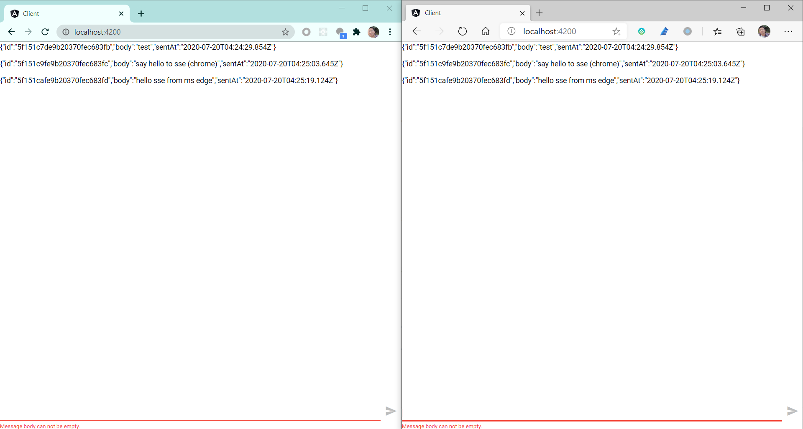

# Building a Chat application with Angular and Spring Reactive SSE


In this post, we will use Server Sent Events instead of WebSocket to broadcast messages to clients.

If you have missed the posts about the implementation of the WebSocket version,  check [here](https://medium.com/@hantsy/building-a-chat-application-with-angular-and-spring-reactive-websocket-400e0769f4ec) and [part 2](https://medium.com/@hantsy/building-a-chat-application-with-angular-and-spring-reactive-websocket-part-2-ad140125cbd2?source=your_stories_page---------------------------).

Unlike WebSocket, SSE (Server Sent Events) is a one-way direction protocol, and used for the server-to-client messaging case, and it only accepts text based messages. A good use case is to send notifications to clients, like that done in the push notification feature of the mobile apps. In this demo, we will use it to update the message list in the client.

From a developer's perspective, there is no much difference between Server Sent Events and HTTP based RESTful APIs, SSE requires a specific media type - `text/event-stream` when emitting messages to clients. In the client application, use the browser built-in `EventSource` to subscribe it.

If you have used SSE in Spring MVC or standard Jakarta EE platform, you could have to emit the event manually.  SSE concept is a good match with the Reactor's `Flux`, which serves an infinite stream to clients. Spring WebFlux simplifies the work,  a SSE endpoint is no difference from a general RESTful APIs in a `Controller`.

Firstly let's create the server side. Generate a project skeleton using [Spring Initializr](https://start.spring.io).

* Project type: Gradle
* Language: Kotlin
* Spring Boot version :2.4.0M1
* Project Metadata/Java: 14
* Dependencies: Reactive Web

Hit the **Generate** button to download the generated archive,  and extract it into your local disk.

Make sure you have installed the latest JDK 14  ([AdoptOpenJDK]( https://adoptopenjdk.net/) is highly recommended),  then import the source codes in your IDEs. eg. Intellij IDEA, and start to implement the server side.

> We will skip the demo of Reactor's Sinks here, and  directly use a MongoDB capped collection as the backend message queue.

Create  a `Message` document definition and a `Repository` for it.

```kotlin
interface MessageRepository : ReactiveMongoRepository<Message, String> {
    @Tailable
    fun getMessagesBy(): Flux<Message>
}

@Document(collection = "messages")
data class Message(@Id var id: String? = null, var body: String, var sentAt: Instant = Instant.now())
```

Create a `@RestController`  to handle messages.

```kotlin
@RestController()
@RequestMapping(value = ["messages"])
@CrossOrigin(origins = ["http://localhost:4200"])
class MessageController(private val messages: MessageRepository) {

    @PostMapping
    fun hello(@RequestBody p: String) =
            this.messages.save(Message(body = p, sentAt = Instant.now())).log().then()

    @GetMapping(produces = [MediaType.TEXT_EVENT_STREAM_VALUE])
    fun messageStream(): Flux<Message> = this.messages.getMessagesBy().log()
}
```

Here we use a `@CrossOrigin` annotation to accept origins of the Angular client application.

Start a MongoDB service as follows. You have to prepare a **capped** messages collection, check [this post ](https://medium.com/@hantsy/building-a-chat-application-with-angular-and-spring-reactive-websocket-part-2-ad140125cbd2) for more details.

```bash
docker-compose up mongodb
```

Run the following command to start the server side application.

```bash
./gradlew bootRun
```

> I also wrote a simple integration test for this SSE, check [here](https://github.com/hantsy/angular-spring-sse-sample/blob/master/server/src/test/kotlin/com/example/demo/SseServerApplicationTests.kt) and play it yourself if you are interested in it.

Let's move to the frontend application, create a new Angular project, or refactor the codes we have done in the former post.

```typescript
export class AppComponent implements OnInit, OnDestroy {
  title = 'client';
  message = '';
  messages: any[];
  sub: Subscription;

  constructor(private zone: NgZone, private http: HttpClient) {
  }

  getMessages(): Observable<any> {

    return Observable.create(
      observer => {

        let source = new EventSource("http://localhost:8080/messages");
        source.onmessage = event => {
          this.zone.run(() => {
            observer.next(event.data)
          })
        }

        source.onerror = event => {
          this.zone.run(() => {
            observer.error(event)
          })
        }
      }
    )
  }

  ngOnInit(): void {
    this.messages = [];
    this.sub = this.getMessages().subscribe({
      next: data => {
        console.log(data);
        this.addMessage(data);
      },
      error: err => console.error(err)
    });
  }

  addMessage(msg: any) {
    this.messages = [...this.messages, msg];
    //console.log("messages::" + this.messages);
  }

  ngOnDestroy(): void {
    this.sub && this.sub.unsubscribe();
  }

  sendMessage() {
    console.log("sending message:" + this.message);
    this.http
      .post(
        "http://localhost:8080/messages",
        this.message
      )
      .subscribe({
        next: (data) => console.log(data),
        error: (error) => console.log(error),
        complete: () => {
          console.log('complete');
          this.message = '';
        }
      });

  }
}
```

Here we observe a `EventSource`  connection in the `ngOnInit` method,  and listen the `MessageEvent` through the `onmessage` hook to receive new messages from the server side.  The `sendMessage` uses Angular `HttpClient` to send a message to the server side.

> More info about the details of  EventSource API,  please go to  [MDN EventSource page](https://developer.mozilla.org/en-US/docs/Web/API/EventSource).

There is no changes in the  `app.component.html` as we discussed in the [former WebSocket version](https://medium.com/@hantsy/building-a-chat-application-with-angular-and-spring-reactive-websocket-400e0769f4ec).

```html
<div fxFlex>
    <p *ngFor="let m of messages">
        {{m}}
    </p>
</div>
<div>
    <form fxLayout="row baseline" #messageForm="ngForm" (ngSubmit)="sendMessage()">
        <mat-form-field fxFlex>
            <input name="message" fxFill matInput #messageCtrl="ngModel" [(ngModel)]="message" required />
            <mat-error fxLayoutAlign="start" *ngIf="messageCtrl.hasError('required')">
                Message body can not be empty.
            </mat-error>
        </mat-form-field>
        <div>
            <button mat-button mat-icon-button type="submit" [disabled]="messageForm.invalid || messageForm.pending">
                <mat-icon>send</mat-icon>
            </button>
        </div>
    </form>
</div>
```

Next run the client application.

```bash
npm run start
```

Open two browser windows(or two different browsers), type some messages in each window and experience it.



Get a copy of [the complete codes](https://github.com/hantsy/angular-spring-sse-sample) from my github and play it yourself.